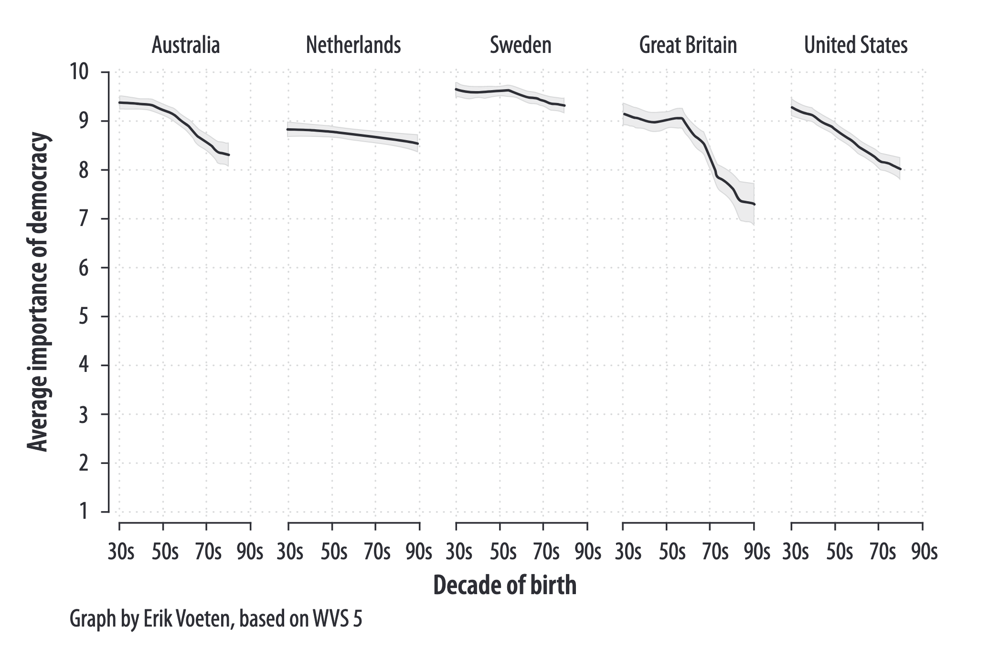

background-image: url('assets/USydLogo.svg')
background-size: 95%

```{r setup, include=FALSE}

options(htmltools.dir.version = FALSE)

knitr::opts_chunk$set(echo = TRUE, message = FALSE, warning = FALSE, 
                      dev = 'svg', 
                      fig.width = 4, 
                      fig.height = 4, out.width="30%",
                      fig.align="center")

library(knitr)
library(kableExtra)
library(tidyverse)
library(sf)
library(DiagrammeR)
library(cowplot)
library(gapminder)

ggplot2::theme_set(theme_bw())

```

---

## Acknowledgement of Country

I would like to acknowledge the Traditional Owners of Australia and recognise their continuing connection to land, water and culture. The  University of Sydney is located on the land of the Gadigal people  of the Eora Nation. I pay my respects to their Elders, past and present.

---

## Recap

- Causal Effects
- Treatment and Outcome Variables
- Individual Causal Effects
- Average Causal Effects
- Randomized Experiments
- Difference-in-Means Estimator
- Units of Measurement of Means and Diffs-in-Means

---

## Today's class


| Time          | Content                                                                       |
|---------------|-------------------------------------------------------------------------------|
| 11:00 - 11:20 | Data visualisation                                                            |
| 11:20 - 11:45 | R Lab: ggplot2 basics and aesthetics; RStudio projects; Subsetting dataframes |
| 11:45 - 12:00 | Individual quiz/tutorial Part 1                                               |
| 12:00 - 12:15 | Break                                                                         |
| 12:15 - 12:45 | R Lab: ggplot2 geometries                                                     |
| 12:45 - 13:00 | Individual quiz/tutorial Part 2                                               |
| 13:00 - 14:00 | Group problem set                                                             |


---

background-image: url(https://learning.oreilly.com/api/v2/epubs/urn:orm:book:9780133041187/files/graphics/fmfig02.jpg)
background-size: 100%

# Data visualisation

---

## The five qualities of great visualisations

1. It is **truthful**, as it’s based on thorough and honest research.

2. It is **functional**, as it constitutes an accurate depiction of the data, and it’s built in a way that lets people do meaningful operations based on it (seeing change in time).

3. It is **beautiful**, in the sense of being attractive, intriguing, and even aesthetically pleasing for its intended audience—scientists, in the first place, but the general public, too.

4. It is **insightful**, as it reveals evidence that we would have a hard time seeing otherwise.

5. It is **enlightening** because if we grasp and accept the evidence it depicts, it will change our minds for the better.

Cairo, A. (2016). 2. The five qualities of great visualizations. *In The Truthful Art: Data, Charts, and Maps for Communication*. Pearson Education.

---

## What Makes Bad Figures Bad 

### 1. Bad taste

.center[</img>]

Healy, K. (2018). *Data visualization: A practical introduction*. Princeton University Press.

---

## What Makes Bad Figures Bad

### 2. Bad data: How do you read this figure?

.center[</img>]

Healy, K. (2018). *Data visualization: A practical introduction*. Princeton University Press.

---

### 2. Bad data

What are the problems with this figure? 

> ... lines do not show a trend measured each decade from the 1930s but rather differences in the answers given by people born in different decades, all of whom were asked the question at the same time. Given that, a bar graph might have been a more appropriate to display the results.

> ... the survey question asked respondents to rate the importance of living in a democracy on a ten-point scale, with 1 being “Not at all Important” and 10 being “Absolutely Important.” The graph showed the difference across ages of people who had given a score of 10 only, not changes in the average score on the question.


---

### This is a more appropriate way to represent the same data ...



---

## What Makes Bad Figures Bad

### 3. Bad perception

.center[</img>]

Healy, K. (2018). *Data visualization: A practical introduction*. Princeton University Press.

---

##  Basic perceptual tasks for nine chart types

.pull-left[

.center[</img>]

]


.pull-right[

### Channels for mapping unordered categorical data, arranged top-to-bottom from more to less effective, after Munzer (2014, 102).

Source: Healy, K. (2018). Data visualization: A practical introduction. Princeton University Press.

]


---

## Why do we visualise data?

#### 1. We visualise data because we want to understand it as part of our *analysis* process. 

.pull-left[

```{r echo = F, out.width = "90%"}
cowplot::plot_grid(
  ggplot(anscombe, aes(x = x1, y = y1)) +
    geom_point() +
    geom_smooth(method = 'lm', se = FALSE) +
    coord_cartesian(xlim = c(0, 20), ylim = c(0,15)),
  ggplot(anscombe, aes(x = x2, y = y2)) +
    geom_point() +
    geom_smooth(method = 'lm', se = FALSE) +
    coord_cartesian(xlim = c(0, 20), ylim = c(0,15)),
  ggplot(anscombe, aes(x = x3, y = y3)) +
    geom_point() +
    geom_smooth(method = 'lm', se = FALSE) +
    coord_cartesian(xlim = c(0, 20), ylim = c(0,15)),
  ggplot(anscombe, aes(x = x4, y = y4)) +
    geom_point() +
    geom_smooth(method = 'lm', se = FALSE) +
    coord_cartesian(xlim = c(0, 20), ylim = c(0,15)),
  ncol = 2)
```

]

.pull-right[

Consider these data. 

These four combinations of variables return the exact same correlation and slope. 

And yet these variables are totally different - something you might miss if you don't visualise it before jumping into your analysis.

]


---

## Why do we visualise data?

#### 2. We visualise data to (1) communicate to (2) some audience (3) selected insights from our data analysis excercise

.center[</img>]

---
class: inverse, center, middle

# Lab

---

## The gapminder package

To replicate the code in the next slide, you need to install and load the *gapminder* package. 

.pull-left[

Do it now with 

```{r eval = F}

install.packages("gapminder")

library(gapminder)

```

]

.pull-right[
</img>
]

---

## Preliminary information (1/2)

Q: **What is a tibble?** A: Tibbles *are* data frames.<sup>1</sup>

```{r inlude = F}
gapminder 
```

Q: What does a row in this data frame represent?  

.footnote[
[1] If you want to know more: https://r4ds.had.co.nz/tibbles.html
]

---

## Preliminary information (2/2)

Q: **What is tidy data?** 

A: Simply, *tidy* data is data that is in a single rectangular data object of class `data.frame` (or `tibble`), where

.pull-left[

1. Every **column** is a variable.

2. Every **row** is an observation.

3. Every **cell** is a single value.

]

.pull-right[

```{r echo = F}
gapminder %>%
  dplyr::select(1:4) %>%
  dplyr::slice(1:4) %>%
  knitr::kable()
```


]

</br>

Remember that if your data is not *tidy*, ggplot2 will not take it!

For more information, https://cran.r-project.org/web/packages/tidyr/vignettes/tidy-data.html 

---

## How to use RStudio projects

[Link to Canvas page](https://canvas.sydney.edu.au/courses/59609/pages/how-to-use-rstudio-projects?module_item_id=2356233)

---

## Visualisations in R

The two most popular ways to make data visualisation in R are 

1. To use the **base** package.

2. To use the **ggplot2** package, which is part of the *Tidyverse*, "a collection of R packages designed for data science" (see https://www.tidyverse.org/). 

As you will soon realise, the textbook doesn't use ggplot2 but instead produces all the visualisations using the base package. 

---

### Visualisations in R: base vs ggplot2

With the base package ...

```{r eval = F}
plot(x = gapminder$gdpPercap, 
     y = gapminder$lifeExp)
```

... and with ggplot2

```{r eval = F}
ggplot(data = gapminder, 
       mapping = aes(x = gdpPercap,
                     y = lifeExp)) +
  geom_point()
```

---

### Visualisations in R: base vs ggplot2

With these results: 

.pull-left[

```{r fig.cap = "base", fig.width = 4, fig.height = 4, echo = F, out.width='80%'}
plot(x = gapminder$gdpPercap, 
     y = gapminder$lifeExp)
```

]

.pull-right[

```{r fig.cap = "ggplot2",  fig.width = 4, fig.height = 4, echo = F, out.width='80%'}
ggplot(data = gapminder, 
       mapping = aes(x = gdpPercap,
                     y = lifeExp)) +
  geom_point()
```

]

---

class: inverse, center, middle

# ggplot2: the basics

---

## Why to use ggplot2?

1. If ggplot2 is more *expensive* in terms of lines of code (see previous slides) is also more *effective* and *intuitive* for making *complex* visualisations.

2. By learning ggplot2, you learn a basic visualisation grammar that is use by a large number of third-party packages (ggplot2 is the *de-facto* visualisation standard for R).

3. ggplot2 figures look much better already in its default version (so without spending time fine-tuning it). 

4. The documentation is great.  

.center[</img>]


---

## The basics of ggplot2

ggplot2 builds your visualisation by *mapping* 

* **variables** 

onto 

* **visual elements** or **aesthetics**: with the function `aes()` (e.g. lines, dots, colours, shapes, areas, labels, ect...) 


```{r eval = F}

p <-  
  ggplot(data = <data>, 
         mapping = aes(<aesthetic> = <variable>,
                       <aesthetic> = <variable>,
                       <   ...   > = <   ...  >))
# Don't run. Credit: Healy, 2018
 
```

---

## The basics of ggplot2

This creates a ggplot object, with all the instructions to map *variables* to *aesthetics.* But it won't visualise anything yet...

```{r out.width = "15%"}

p <-  
  ggplot(data = gapminder, 
         mapping = aes(x = gdpPercap,
                       y =lifeExp))

class(p)
```

```{r echo = F, fig.width = 4, fig.height = 4, out.width="30%"}
p
```


---

## The basics of ggplot2

After we have specified `data = <data>` and `mapping = aes(...)`, we need to pass at least an additional *layer* specifying the *geometry* we want, so that ggplot2 can visualise the mapping.  


```{r out.width="45%"}
p + 
  geom_point()
```

---

## Layers

ggplots are constructed by progressively adding new layers with new specifics about your plot. The minimum number required is two: `ggplot(...)` + `geom_<type>(...)` with all the other required layers being set by default.   


.pull-left[

```{r eval = F}

ggplot(...) + #<<
  geom_<type>(...) + #<<
  scale_<mapping>_<type>(...) +
  coord_<type>(...) + 
  labs(...) +
  facet_grid(...)
  
# Don't run. Credit: Healy, 2018
```


]

.pull-right[</img>]

---

## Essential ggplot2 decisions

### Layer 0 (the base, invisible layer)

1. Tell the `ggplot()` function what our data is with the `data = <data>` argument.

2. Tell the `ggplot()` function the *relationships* you want to visualise with the `mapping` attribute and the `aes()` function (`mapping = aes()`).

    ### Layer 1 (visible)

3. Tell the geometry you want to see with `geom_<type>` (e.g. `geom_point()`) 

    ### Layer 2+ (visible)
    
4. Use additional functions (e.g. `scale_y_continuous()`) to specify everything else 😊


---

class: inverse, center, middle

# Aesthetic mapping

---

## Aesthetic mapping

Consider this, 

* Data => variables => *values*

* Aesthetics => properties => *levels*

Values and levels need to be of the same type (continuous vs categorical or you will get an error/warning) 

And remember,

> An aesthetic is a visual property of the objects in your plot.

> You can convey information about your data by mapping the aesthetics in your plot to the variables in your dataset.

(Wickham & Grolemund, 2017)

.center[</img>]

---

## Aesthetic mapping

```{r out.width="60%", fig.width = 6, fig.height = 4}
ggplot(data = gapminder, 
       mapping = aes(x = gdpPercap, 
                     y = lifeExp, 
                     color = continent)) +
  geom_point()
```


What is going on here? What are the aesthetic *properties* (or *arguments*) that we have set? What do they do?

---

### Aesthetic mapping

There are a many different aesthetic property you can set and whether you need to specify them depends on the type of geometry you will use.

So let's set up our layer 0 and store it into `g`... 

```{r}
g <- ggplot(data = gapminder)
```


Among the most common aesthetic properties are **`x`** and **`y`** which position in a 2D space. These are usually the only properties that are strictly required.


```{r out.width = "20%"}
g + geom_point(mapping = aes(x = gdpPercap, y = lifeExp))
```


---

### Aesthetic mapping

#### size

```{r fig.width=5, fig.height=4, out.width="60%"}
g + 
  geom_point(mapping = aes(x = gdpPercap, 
                           y = lifeExp, 
                           size = lifeExp)) #<<
```

---

### Aesthetic mapping

#### shape

```{r fig.width=5, fig.height=4, out.width="60%"}
g + 
  geom_point(mapping = aes(x = gdpPercap, 
                           y = lifeExp, 
                           shape = continent)) #<<
```

---

### Aesthetic mapping

#### colour

```{r fig.width=5, fig.height=4, out.width="60%"}
g + 
  geom_point(mapping = aes(x = gdpPercap, 
                           y = lifeExp, 
                           colour = continent)) #<<
```

---

### Aesthetic mapping

#### label

```{r fig.width=5, fig.height=4, out.width="60%"}
g + 
  geom_text(mapping = aes(x = gdpPercap, #<<
                           y = lifeExp, 
                           label = continent)) #<<
```

---

### Aesthetic mapping vs aesthetic setting

#### label

```{r fig.width=5, fig.height=4, out.width="50%"}
g + 
  geom_text(mapping = aes(x = gdpPercap, 
                           y = lifeExp),
            label = "My new label") #<<
```

What happened here?

---

### Aesthetic mapping vs aesthetic setting

#### alpha (transparency, in range 0 to 1)

```{r fig.width=5, fig.height=4, out.width="60%"}
g + 
  geom_point(mapping = aes(x = gdpPercap, 
                           y = lifeExp),
            alpha = 0.2) #<< 
```

---

### Aesthetic mapping (advanced topics!)

Aesthetics can be mapped at the level of the individual geom layer, and so can data...

This can be confusing but actually allows you a lot of flexibility...

```{r fig.width=5, fig.height=4, out.width="50%"}
ggplot() + # Note, this is empty!
  geom_point(data = gapminder, 
             mapping = aes(x = gdpPercap, 
                           y = lifeExp),
             alpha = .2)
```

---

### Aesthetic mapping (advanced topics!)

And then...

```{r fig.width=5, fig.height=4, out.width="40%"}
ggplot() + 
  geom_point(data = gapminder, 
             mapping = aes(x = gdpPercap, 
                           y = lifeExp),
             alpha = .2) +
    geom_point(data = gapminder[gapminder$country == "Australia",], #<<
             mapping = aes(x = gdpPercap, #<<
                           y = lifeExp), #<<
             colour = "orange", size = 4) #<<
```


---

## How defining data and aesthetics for layers

Data (`data = <data>`) and aesthetics (`mapping = aes(<aesthetics>)`) are defined top-down. Each layer will look for a definition of the two above if not directly provided.

```{r eval = F}

ggplot(data = gapminder, 
             mapping = aes(x = gdpPercap, 
                           y = lifeExp)) + 
  geom_<type>() +
  geom_<type>()


```

Let's try this out...


---

class: inverse, center, middle

# Individual quiz/tutorial

Up to **Size and Colour** section (included)

---

class: inverse, center, middle

# Subsetting data frames


---

## Subsetting data frames

* Data frames are a combination or vectors. 
* Vectors have one dimensions: **length**. Data frame have two!

Remind how to subset vectors

```{r}
my_vec <- c("one", "two", "three")
my_vec[2]
my_vec[c(1,3)]
```

And this is the template on how you subset data frames:

```{r eval = FALSE}
gapminder[ ..rows.. , ..columns..] # Don't run
```

.footnote[Note the comma!]

---

#### Selecting rows or columns based on position

```{r}
gapminder[ c(1,3) , 4  ]
```

#### Selecting columns based on name

```{r}
gapminder[ , c("year", "country")]
```

---

#### Selecting rows based on a condition

```{r}
gapminder[gapminder$country == "Australia" , ]
```

---

#### Selecting rows based on more than one condition

```{r}
gapminder[gapminder$country == "Australia" & gapminder$year == 1972, ]
```

---

class: inverse, center, middle

# Geometries

---

### What geometries can I use? 

A lot! There are about 50 geometries you can use in ggplot2. A complete list is [here](https://www.maths.usyd.edu.au/u/UG/SM/STAT3022/r/current/Misc/data-visualization-2.1.pdf). 

### Which one should I use?

It depends on the *type of variables* you plan to visualise 

- **Categorical** (a.k.a. **discrete**); or
- **Numerical** (a.k.a. **continuous**)

but it also depends on whether you want to visualise

- **Distributions**; or
- **Relationships**

---

class: inverse, center, middle

# Visualising distributions

---

## A Categorical Variable

- **Definition:** A variable is **categorical** if it can only take one of a small set of values.

- **Visualization:** To examine the distribution of a categorical variable, use a bar chart. The height of the bars displays how many observations occurred with each `x` value.

```{r}
ggplot(gapminder, aes(x = continent)) +
geom_bar()
```

.footnote[Adapted from *R for data science* (2023), https://r4ds.hadley.nz/]

---

## A Categorical Variable

- **Reordering Bars:** In bar plots of categorical variables with non-ordered levels, it's often preferable to reorder the bars based on their frequencies.

```{r}
ggplot(gapminder, aes(x = fct_infreq(continent))) +
geom_bar()
```

.footnote[Adapted from *R for data science* (2023), https://r4ds.hadley.nz/]

---

## A Numerical Variable

- **Definition:** A variable is **numerical** (a.k.a. continuous) if it can take on a wide range of numerical/quantitative values.

- **Visualisation:** A commonly used visualization for distributions of continuous variables is a *histogram*.

```{r}
ggplot(gapminder, aes(x = lifeExp)) +
  geom_histogram(binwidth = 5) # width of 5 years (as lifeExp is in years)
```

.footnote[Adapted from *R for data science* (2023), https://r4ds.hadley.nz/]


---

## Alternative Visualisation: The Density Plot

- **Definition:** A density plot is a smoothed-out version of a histogram and is practical for continuous data that comes from an underlying smooth distribution.

```{r}
ggplot(gapminder, aes(x = lifeExp)) +
geom_density()
```

.footnote[Adapted from *R for data science* (2023), https://r4ds.hadley.nz/]

---

## When you visualise distributions of a single variable of the `geom_` functions will transform your data, creting a new variable before visualising it ...


---

class: inverse, center, middle

# Visualising Relationships

---


## Aesthetics in Variable Distribution vs Relationships


.content-box-yellow[

### Distribution needs only one variable mapping

```{r eval = F}
geom_histogram(mapping = aes(x = var)) # Don't run
```

]

.content-box-purple[

### Relationships need two variables

```{r eval = F}
geom_point(mapping = aes(x = var1, y = var2)) # Don't run
```

]

.footnote[Adapted from *R for data science* (2023), https://r4ds.hadley.nz/]

---

## A Numerical and a Categorical Variable

- **Boxplots:** Visualize the relationship between a numerical and a categorical variable using side-by-side box plots.

- **Explanation of Boxplot Components:**
  - **Box:** Indicates the interquartile range (IQR).
  - **Median Line:** Displays the median of the distribution.
  - **Whiskers and Outliers:** Extends to the farthest non-outlier point; outliers are plotted individually.

.pull-left[

```{r eval = F}
ggplot(gapminder, 
       aes(x = continent, 
           y = lifeExp)) +
  geom_boxplot()
```

]

.pull-right[

```{r echo = F, out.width = "60%"}
ggplot(gapminder, aes(x = continent, y = lifeExp)) +
  geom_boxplot()
```

]

.footnote[Adapted from *R for data science* (2023), https://r4ds.hadley.nz/]

---

### More on boxplots if you need it!

.pull-left[

]

.pull-right[
<iframe width="560" height="315" src="https://www.youtube.com/embed/zc4ymS5xBQA?si=s-v_C1U_rOgT5GCc" title="YouTube video player" frameborder="0" allow="accelerometer; autoplay; clipboard-write; encrypted-media; gyroscope; picture-in-picture; web-share" referrerpolicy="strict-origin-when-cross-origin" allowfullscreen></iframe>
]


---

## Alternative Visualization: Density Plot by Category

- **Explanation:** Density plots can be split by categorical variables using color and fill aesthetics.

```{r fig.width = 6, fig.height= 4, out.width='60%'}
ggplot(gapminder, aes(x = lifeExp, color = continent, fill = continent)) +
  geom_density(alpha = 0.5)
```

.footnote[Adapted from *R for data science* (2023), https://r4ds.hadley.nz/]
---

## Two Categorical Variables

.pull-left[

**Stacked Bar Plots:** Visualise relationships between two categorical variables using stacked bar plots.

```{r out.width='70%'}
ggplot(gapminder[gapminder$pop>100000000,], 
       aes(x = continent, 
           fill = country)) +
  geom_bar()
```

]

.pull-right[

**Relative Frequency Plot:** Adjust the bar plot to display relative frequencies using `position = "fill"`.

```{r out.width='70%'}
ggplot(gapminder[gapminder$pop>100000000,], 
       aes(x = continent, 
           fill = country)) +
  geom_bar(position = "fill")
```

]

---

## Two Numerical Variables

- **Scatterplots:** A scatterplot is commonly used to visualise the relationship between two numerical variables.

```{r}
ggplot(gapminder, aes(x = lifeExp, y = gdpPercap)) +
  geom_point()
```
.footnote[Adapted from *R for data science* (2023), https://r4ds.hadley.nz/]

---

## Two Numerical Variables (when one is time)

- **Lines** are the default standard to visualise a variable from the same individual over time.

```{r}
ggplot(gapminder[gapminder$country == "Australia",], 
       aes(x = year, y = lifeExp)) +
  geom_line()
```


---

## Three or More Variables

**Adding Aesthetics:** Incorporate more variables into a plot by mapping them to additional aesthetics like color and shape.

```{r }
ggplot(gapminder, 
       aes(x = lifeExp, y = gdpPercap, 
           colour = continent, size = pop)) +
  geom_point()
```
.footnote[Adapted from *R for data science* (2023), https://r4ds.hadley.nz/]
---

## Three or More Variables: Faceting

**Faceting:** Use facets to create subplots for each category of a variable, reducing plot clutter.

```{r }
ggplot(gapminder, 
       aes(x = lifeExp, y = gdpPercap, 
           size = pop)) +
  geom_point() +
  facet_wrap(~continent)
```

.footnote[Adapted from *R for data science* (2023), https://r4ds.hadley.nz/]


---

class: inverse, center, middle

# Position adjustement

---

## Position scales 

The `scale_<mapping>_<type>()` functions allows you to position scales for your data. It basically, allows to add specifics about how your data/aesthetic mapping should behave. 

Common scenarios are ...

---

## Position scales 

### Setting the colour palette for your mapping

```{r out.width = '40%'}
ggplot(data = gapminder, aes(x = continent, fill = continent))  +
  geom_col(aes(y = pop)) +
  scale_fill_brewer(palette = "Set1")  #<<
```

---

## Position scales 

###  Setting the limits of your scale to zoom within your chart in some range on the y (vertical axis);

```{r out.width = '40%'}
ggplot(data = gapminder, mapping = aes(x = gdpPercap, y = lifeExp))  +
  geom_point() +
  scale_y_continuous(limits = c(50, 60)) #<<
```

---

## Position scales

### Setting the colour palette for your mapping

```{r out.width = '40%'}
ggplot(data = gapminder, 
       mapping = aes(x = gdpPercap, y = lifeExp,
                     colour = lifeExp))  +
  geom_point() +
  scale_colour_viridis_c() #<<
```

---

## Position scales

### Using a scale transformation

```{r out.width = '40%'}
ggplot(data = gapminder, 
       mapping = aes(x = gdpPercap, y = lifeExp))  +
  geom_point() +
  scale_x_log10() #<<
```

---

class: inverse, center, middle

# Plot labels

---

To set the labels of your plot's elements - *title*, *axes*, *legends* - you add a `labs()` layer.

It is pretty self-explanatory:

```{r out.width = "75%", fig.width = 6, fig.height = 3}
ggplot(data = gapminder, 
       mapping = aes(x = gdpPercap, y = lifeExp, colour = lifeExp))  +
  geom_point() +
  scale_colour_viridis_c() +
  labs(x = "My x-axis label", y = "My y-axis label",
       colour = "My colour-legend title,", 
       title = "my plot's title...", subtitle = "my subtitle",
       caption = "...and my caption")
```

---

### The main elements of ggplot’s grammar of graphics

.pull-left[

.center[</img>]]

.pull-right[Check out the website containing an almost integral version of Kieran Healy's 🔥 book 🔥.

.center[

</img>

</br>
https://socviz.co/
]]

---

class: inverse, center, middle

# Individual quiz/tutorial

From **One variable categorical (a.k.a., discrete)** until the end


---

class: inverse, center, middle

# Group problem set

---

class: inverse, center, middle

# Attendance


---
class: inverse, center, middle

# Questions?

---
class: center, middle

# See you next week with Measurement!