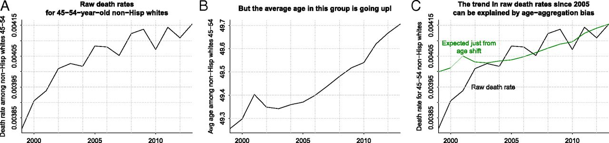
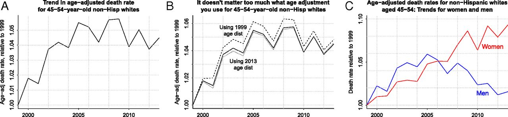

## Acknowledgement of Country

I would like to acknowledge the Traditional Owners of Australia and recognise their continuing connection to land, water and culture. The University of Sydney is located on the land of the Gadigal people of the Eora Nation. I pay my respects to their Elders, past and present.

## Qualitative Anonymous Feedback (from Canvas)

## Note

These slides are developed based on:
 
- Alexander, R. (2023). *Telling Stories with Data: With Applications in R*. CRC Press.
- Gelman, A., Hill, J., & Vehtari, A. (2021). *Regression and Other Stories*. Cambridge University Press.

Students are encouraged to refer to the relevant chapters for additional detail and examples.

```{r}
#| echo: false
#| message: false
library(tidyverse)
library(rstanarm)
library(broom)
library(knitr)
library(modelsummary)
# Optional packages for maps (install if needed)
# install.packages(c("ggmap", "maps", "mapproj", "tidygeocoder"))
# library(ggmap)
# library(maps)
# library(mapproj)
# library(tidygeocoder)
```

## Learning Objectives

By the end of this lecture, you will be able to:

1. Check regression assumptions systematically
2. Create and interpret residual plots
3. Transform variables appropriately (log, sqrt)
4. Create publication-quality tables and maps
5. Prepare spatial visualizations using ggplot2 and ggmap
6. Communicate statistical results effectively
7. Diagnose and address common model problems

::: notes
This week brings together model diagnostics and effective communication. We'll learn how to check if our models are appropriate and how to present our findings professionally using tables, maps, and clear writing.
:::

## Readings for This Week

::: {layout-ncol="2"}
### TSwD (Alexander)

- Ch 4: Writing research
- Ch 5: Static communication
  - 5.3 Tables
  - 5.4 Maps

### ROS (Gelman et al.)

- Ch 2.4: Data and adjustment
- Ch 11: Assumptions, diagnostics, and model evaluation
- Ch 12: Transformations and regression
:::

# Assumptions of Regression Analysis

## The Six Assumptions (in order of importance)

::: callout-important
### Key Assumptions

1. **Validity** - Data maps to research question
2. **Representativeness** - Sample represents population
3. **Additivity and linearity** - Linear relationships
4. **Independence of errors** - Errors are uncorrelated
5. **Equal variance of errors** - Homoscedasticity
6. **Normality of errors** - For prediction intervals
:::

::: footnotes
ROS, Ch. 11
:::


::: notes
We list these in decreasing order of importance. Validity is most important but often overlooked. Normality is least important for estimating coefficients.
:::

## 1. Validity

The data you are analysing should map to the research question you are trying to answer.

. . .

This means:

- The **outcome measure** should accurately reflect the phenomenon of interest
- The model should include **all relevant predictors**
- The model should **generalise** to the cases to which it will be applied

. . .

::: callout-warning
### Common Pitfall
A model of test scores will not necessarily tell you about child intelligence or cognitive development. A model of incomes will not necessarily tell you about total assets.
:::

## 2. Representativeness

The key assumption is that the data are representative of the distribution of the outcome $y$ given the predictors $x_1, x_2, \ldots$

. . .

::: callout-tip
### Important Distinction
- **Selection on $x$** does not interfere with inferences
- **Selection on $y$** does interfere with inferences

For example: in a regression of earnings on height and sex, it's acceptable for women and tall people to be overrepresented, but problems arise if too many rich people are in the sample.
:::

## 3. Additivity and Linearity

The deterministic component is a linear function of the separate predictors:

$$y = \beta_0 + \beta_1 x_1 + \beta_2 x_2 + \cdots$$

. . .

**When violated:**

- Transform the data (e.g., if $y = abc$, then $\log y = \log a + \log b + \log c$)
- Add interactions
- Use $1/x$ or $\log(x)$ instead of $x$
- Use nonlinear functions (splines, etc.)

## 4. Independence of Errors

The simple regression model assumes that the errors from the prediction line are **independent**.

. . .

This assumption is violated in:

- **Time series** data (observations over time)
- **Spatial** data (observations across geography)
- **Multilevel** settings (observations nested in groups)

::: notes
When errors are correlated, standard errors can be underestimated, leading to false confidence in our estimates.
:::

## 5. Equal Variance of Errors (Homoscedasticity)

**Heteroscedasticity** = unequal error variance

. . .

::: columns
::: {.column width="50%"}
### Impact
- Affects probabilistic prediction
- Does not affect coefficient estimates
- May require weighted least squares
:::

::: {.column width="50%"}
### Detection
- Residual plots (funnel shape)
- Statistical tests
- Visual inspection
:::
:::

## 6. Normality of Errors

::: callout-note
### Least Important Assumption!
The normality assumption is typically barely important at all for estimating the regression line.

It is relevant when:

- Predicting individual data points
- Constructing prediction intervals
:::

. . .

We do **not** recommend routine Q-Q plots of residuals. Focus on the more important assumptions first!

# Plotting Data and Fitted Models

## Why Plot?

Graphics are helpful for:

1. **Visualising data** - Understanding patterns
2. **Understanding models** - Seeing relationships
3. **Revealing patterns** not explained by fitted models

::: notes
Plotting is not just for presentation—it's a crucial diagnostic tool throughout the modelling process.
:::

## Displaying a Regression Line

```{r}
#| echo: true
#| output-location: column
#| fig-height: 6

# Simulated example
set.seed(853)
n <- 100
mom_iq <- rnorm(n, 100, 15)
kid_score <- 25 + 0.6 * mom_iq + 
  rnorm(n, 0, 18)

df <- data.frame(mom_iq, kid_score)

# Fit model
fit <- lm(kid_score ~ mom_iq, data = df)

# Plot
ggplot(df, aes(x = mom_iq, y = kid_score)) +
  geom_point(alpha = 0.6) +
  geom_smooth(method = "lm", se = TRUE) +
  labs(x = "Mother's IQ Score",
       y = "Child's Test Score") +
  theme_minimal(base_size = 14)
```

## Displaying Uncertainty in the Fitted Regression

```{r}
#| echo: true
#| output-location: column
#| fig-height: 6

# Extract coefficients and simulate
coefs <- coef(fit)
se <- summary(fit)$coefficients[, 2]

# Create plot with uncertainty bands
ggplot(df, aes(x = mom_iq, y = kid_score)) +
  geom_point(alpha = 0.5) +
  # Add several simulated lines
  geom_abline(intercept = coefs[1] + rnorm(10, 0, se[1]),
              slope = coefs[2] + rnorm(10, 0, se[2]),
              alpha = 0.2, colour = "grey50") +
  geom_smooth(method = "lm", se = FALSE, 
              colour = "blue", linewidth = 1) +
  labs(x = "Mother's IQ Score",
       y = "Child's Test Score",
       title = "Regression with uncertainty") +
  theme_minimal(base_size = 14)
```

::: notes
The grey lines show different plausible regression lines from the posterior distribution of parameters.
:::

## From "One Truth" to "Many Truths"
Last week, we discussed **Bayesian Thinking**, where we treat parameters (like our slope $\beta_1$) as **probability distributions** rather than fixed numbers.

* **Frequentist View:** There is one "true" slope, and our 10 lines represent the error in our estimate.
* **Bayesian View:** All 10 lines are **equally plausible** given our prior beliefs and the data we've seen.
* **The Posterior:** These 10 lines are essentially random draws from the **Posterior Distribution**.


---

## Why this visual feels "Bayesian"
Showing multiple lines is a simplified version of a **Posterior Predictive Check (PPC)**.

1. **Uncertainty is Explicit:** In Bayesian stats, we don't just say "the slope is 0.6." We say, "here are 1,000 slopes that could explain this data."
2. **Beyond the p-value:** Instead of asking "is the slope zero?", we look at the *density* of these lines. If most lines tilt upward, we are confident in the positive relationship.
3. **Generative Logic:** Just like we used `rnorm()` to "draw" these lines, Bayesian models use MCMC (Markov Chain Monte Carlo) to "draw" plausible versions of the world.

> **Key Takeaway:** The 10 lines change the conversation from "What is the answer?" to "What range of answers is supported by our evidence?"


# Residual Plots

## What Are Residuals?

The **residuals** are the differences between observed and predicted values:

$$r_i = y_i - \hat{y}_i = y_i - X_i\hat{\beta}$$

. . .

::: callout-tip
### Why Plot Residuals?
If the model is correct, residuals should look **randomly scattered** around a horizontal line at zero. This is often easier to assess than comparing data to a fitted line.
:::

## Creating a Residual Plot

```{r}
#| echo: true
#| output-location: column
#| fig-height: 6

# Calculate residuals and fitted values
df$fitted <- fitted(fit)
df$residuals <- residuals(fit)

# Residual plot
ggplot(df, aes(x = fitted, y = residuals)) +
  geom_point(alpha = 0.6) +
  geom_hline(yintercept = 0, 
             linetype = "dashed",
             colour = "red") +
  geom_hline(yintercept = c(-summary(fit)$sigma,
                            summary(fit)$sigma),
             linetype = "dotted",
             colour = "grey50") +
  labs(x = "Fitted Values",
       y = "Residuals",
       title = "Residual Plot") +
  theme_minimal(base_size = 14)
```

## The "Standard" Error: What is Sigma?
While our 10 grey lines showed uncertainty in our **aim**, $\sigma$ (the Residual Standard Error) shows the spread of our **misses**.

* **The Ruler of Residuals:** $\sigma$ is essentially the "standard deviation" of the residuals. It tells us the typical distance a data point falls from the regression line.
* **The 68% Rule:** In a well-behaved model, we expect about **68% of our observations** to fall within the dotted lines ($\pm 1\sigma$).
* **The "Noise" Floor:** $\sigma$ represents the inherent randomness (or unmeasured factors) that our model cannot explain. 


```{r}
#| echo: false
#| fig-width: 12
#| fig-height: 6
#| out-width: "100%"
#| fig-align: "center"

library(ggplot2)

# 1. Data Prep
x <- seq(-4, 4, length.out = 1000)
y <- dnorm(x, mean = 0, sd = 1)
df2 <- data.frame(x = x, y = y)

get_poly <- function(range) {
  poly_x <- seq(range[1], range[2], length.out = 100)
  poly_y <- dnorm(poly_x, mean = 0, sd = 1)
  data.frame(x = c(poly_x, rev(poly_x)), y = c(poly_y, rep(0, length(poly_y))))
}

# 2. Build the Plot
ggplot(df2, aes(x = x, y = y)) +
  # Use linewidth instead of size for lines
  geom_line(linewidth = 1, color = "black") +
  
  # Shaded Regions
  geom_polygon(data = get_poly(c(-3, 3)), fill = "#dbeeff", alpha = 0.6) +
  geom_polygon(data = get_poly(c(-2, 2)), fill = "#b3d9ff", alpha = 0.7) +
  geom_polygon(data = get_poly(c(-1, 1)), fill = "#80c1ff", alpha = 0.8) +
  
  # FIX: Use annotate() for segments to avoid the "1000 rows" warning
  annotate("segment", x = c(-1, 1, -2, 2, -3, 3), xend = c(-1, 1, -2, 2, -3, 3),
           y = 0, yend = dnorm(c(-1, 1, -2, 2, -3, 3)), 
           linetype = "dashed", color = "grey40") +
  
  # FIX: Use 'fontface' for annotate()
  annotate("text", x = 0, y = -0.05, label = "68.3%", size = 5, fontface = "bold") +
  annotate("text", x = 0, y = -0.13, label = "95.4%", size = 5, fontface = "bold") +
  annotate("text", x = 0, y = -0.21, label = "99.7%", size = 5, fontface = "bold") +
  
  # Brackets (as segments)
  annotate("segment", x = -1, xend = 1, y = -0.02, yend = -0.02, linewidth = 1) +
  annotate("segment", x = -2, xend = 2, y = -0.1, yend = -0.1, linewidth = 1) +
  annotate("segment", x = -3, xend = 3, y = -0.18, yend = -0.18, linewidth = 1) +
  
  scale_x_continuous(breaks = -3:3, 
                     labels = c("-3\u03c3", "-2\u03c3", "-1\u03c3", "0\u03c3", "1\u03c3", "2\u03c3", "3\u03c3")) +
  
  theme_minimal(base_size = 14) +
  labs(title = "The 68-95-99.7 Rule", x = "Standard Deviations (\u03c3)", y = "Density") +
  theme(
    # FIX: Use 'face' (NOT fontface) inside element_text()
    plot.title = element_text(hjust = 0.5, face = "bold"),
    panel.grid.minor = element_blank(),
    plot.margin = unit(c(1, 1, 3, 1), "cm")
  )
```


> **Intuition:** If the blue line is our "Best Guess," the area between the dotted lines is our **"Typical Error Zone."** If a point is outside these lines, it's an unusually large "miss" for this model.

## Interpreting Residual Plots

::: {layout-ncol="2"}
### Good Signs ✓

- Random scatter around zero
- Roughly constant spread
- No obvious patterns
- No extreme outliers

### Warning Signs ✗

- Funnel shape (heteroscedasticity)
- Curved pattern (nonlinearity)
- Clusters (missing predictors)
- Extreme values (outliers)
:::

## Residuals vs. Fitted vs. Observed

::: callout-important
### Key Insight
Always plot residuals against **fitted values**, not observed values!

Plotting residuals vs. observed values will show misleading patterns even when the model is correct.
:::

. . .

**Why?** The errors $\epsilon_i$ should be independent of the predictors $x_i$, not the data $y_i$.

::: notes
This is a common mistake. Fake-data simulation can help understand why residuals vs. fitted is the correct choice.
:::

## Common Residual Patterns

```{r}
#| echo: false
#| fig-height: 5

# Create example patterns
set.seed(42)
n <- 100
x <- runif(n, 0, 10)

# Good residuals
good_resid <- rnorm(n, 0, 1)

# Heteroscedastic
hetero_resid <- rnorm(n, 0, 0.5 + 0.3 * x)

# Nonlinear
nonlin_y <- 2 + 3*x - 0.3*x^2 + rnorm(n, 0, 1)
nonlin_fit <- lm(nonlin_y ~ x)
nonlin_resid <- residuals(nonlin_fit)

# Combine
patterns <- data.frame(
  fitted = rep(x, 3),
  residual = c(good_resid, hetero_resid, nonlin_resid),
  type = factor(rep(c("Good: Random Scatter", 
                      "Problem: Heteroscedasticity",
                      "Problem: Nonlinearity"), each = n))
)

ggplot(patterns, aes(x = fitted, y = residual)) +
  geom_point(alpha = 0.5) +
  geom_hline(yintercept = 0, linetype = "dashed", colour = "red") +
  facet_wrap(~type) +
  labs(x = "Fitted Values", y = "Residuals") +
  theme_minimal(base_size = 12)
```

---

### 📋 Head to Canvas and complete A1 (Section 1: Checking Regression Assumptions)

<br>

```{r}
#| echo: false
library(countdown)
countdown(
  minutes = 5,
  color_background = "#003366",
  color_text = "#FFD100",
  color_running_background = "#003366",
  color_running_text = "#FFD100",
  color_finished_background = "#FF0000",
  color_finished_text = "white",
  font_size = "3em"
)
```

# Variable Transformations

## Why Transform Variables?

When additivity and linearity are violated, **transformations** can help:

. . .

1. **Logarithmic** - For multiplicative relationships
2. **Square root** - For moderate compression of high values
3. **Centering** - For interpretable intercepts
4. **Standardising** - For comparable coefficients

## Logarithmic Transformations

::: callout-tip
### When to Use Log Transform
Use logarithms for outcomes that are **all positive** and where effects are likely **multiplicative** rather than additive.
:::

. . .

A linear model on the log scale:
$$\log y_i = \beta_0 + \beta_1 x_{i1} + \beta_2 x_{i2} + \cdots + \epsilon_i$$

Corresponds to a multiplicative model on the original scale:
$$y_i = B_0 \cdot B_1^{x_{i1}} \cdot B_2^{x_{i2}} \cdots E_i$$

where $B_j = e^{\beta_j}$

## Interpreting Log-Scale Coefficients

For **small coefficients** (roughly $|\beta| < 0.25$):

$$e^\beta \approx 1 + \beta$$

. . .

::: callout-note
### Rule of Thumb
A coefficient of $\beta = 0.06$ on the log scale means approximately a **6% difference** in $y$ per unit change in $x$.
:::

```{r}
#| echo: true
# Verify the approximation
c(exp(0.06), 1 + 0.06)
```

## Example: Earnings and Height

```{r}
#| echo: true
#| output-location: column
#| fig-height: 6

# Simulated earnings data
set.seed(123)
n <- 200
height <- rnorm(n, 170, 10)
earnings <- exp(6 + 0.02 * height + 
                rnorm(n, 0, 0.5))

df_earn <- data.frame(height, earnings)

# Compare models
fit_linear <- lm(earnings ~ height, 
                 data = df_earn)
fit_log <- lm(log(earnings) ~ height, 
              data = df_earn)

# Plot on log scale
ggplot(df_earn, aes(x = height, y = earnings)) +
  geom_point(alpha = 0.5) +
  scale_y_log10() +
  geom_smooth(method = "lm") +
  labs(x = "Height (cm)",
       y = "Earnings (log scale)") +
  theme_minimal(base_size = 14)
```

## Natural Log vs. Log Base 10

::: columns
::: {.column width="50%"}
### Natural Log (ln)
- Coefficients directly interpretable as proportional differences
- $\beta = 0.05$ means ~5% difference
- **Preferred for modelling**
:::

::: {.column width="50%"}
### Log Base 10
- Predicted values easier to read
- $\log_{10}(10000) = 4$
- Coefficients require conversion
- Better for data exploration
:::
:::

## Centering and Standardising

**Centering**: Subtract the mean
$$x_{\text{centered}} = x - \bar{x}$$

. . .

**Standardising**: Subtract mean, divide by standard deviation
$$z = \frac{x - \bar{x}}{s_x}$$

. . .

::: callout-tip
### Why Standardise by 2 SD?
Dividing by **2 standard deviations** makes continuous variable coefficients comparable to binary (0/1) variable coefficients.
:::

## Why Standardize by 2 SD?

When we include both **Binary** (0/1) and **Continuous** variables in a model, their coefficients are on different scales. Dividing by $2\sigma$ levels the playing field.

* **The Binary Baseline:** A balanced binary variable (like "Treatment" vs "Control") has a standard deviation of approximately **0.5**.
* **The Continuous Problem:** Standardising a variable by $1\sigma$ gives it an SD of **1.0**, making its coefficient half as "sensitive" as a binary one.
* **The $2\sigma$ Solution:** By dividing a continuous variable by $2$ standard deviations, we give it an SD of **0.5**.


### The Result
A coefficient for a continuous variable now represents a move from **"Low" to "High"** (roughly the 16th to 84th percentile), making it directly comparable to the move from **0 to 1** in a binary variable.

> **Key takeaway:** We scale by $2\sigma$ so we can compare "apples to apples" when looking at which variable has a stronger effect.


## Example: Centering for Interpretability

```{r}
#| echo: true
# Original model - intercept is meaningless
fit_orig <- lm(kid_score ~ mom_iq, data = df)
coef(fit_orig)

# Centered model - intercept is mean kid_score at mean mom_iq
df$mom_iq_c <- df$mom_iq - mean(df$mom_iq)
fit_centered <- lm(kid_score ~ mom_iq_c, data = df)
coef(fit_centered)
```

. . .

The slope is identical, but the intercept now represents the predicted score at the average mother's IQ.

## Square Root Transformation

Use when log transformation is **too strong**:

- Log: Equal ratios get equal treatment (5→10 same as 50→100)
- Square root: More moderate compression

. . .

```{r}
#| echo: true
# Compare transformations
x <- c(0, 100, 1000, 10000, 100000)
data.frame(
  original = x,
  log = round(log(x + 1), 2),  # +1 to handle zero
  sqrt = round(sqrt(x), 2)
)
```


# Data Adjustment: A Case Study

## The Mortality Rate Example

::: callout-important
### The Claim
In 2015, Case and Deaton published that mortality rates for middle-aged white non-Hispanic Americans increased from 1999 to 2013.
:::

. . .

**The problem**: Their numbers were "not age-adjusted within the 10-year 45–54 age group."

. . .

**The issue**: The composition of the 45-54 age group changed as the baby boom generation moved through.

::: notes
This is a famous example of how aggregation bias can lead to misleading conclusions. The changing demographics within an age bracket affected the results.
:::

::: footnotes
From ROS, Ch. 2
:::

---


[(A) Observed increase in raw mortality rate among 45- to 54-y-old non-Hispanic whites, unadjusted for age. (B) Increase in average age of this group as the baby boom generation moves through. (C) Raw death rate, along with trend in death rate attributable by change in age distribution alone, had age-specific mortality rates been at the 2013 level throughout.]{style="font-size: 0.5em;"}


[(A) Age adjusted death rates among 45- to 54-y-old non-Hispanic whites, showing an increase from 1999 to 2005 and a steady pattern since 2005. (B) Comparison of three different age adjustments. (C) Trends in age-adjusted death rates broken down by sex.]{style="font-size: 0.5em;"}


::: footnotes
A. Gelman, & J. Auerbach,  Age-aggregation bias in mortality trends, *Proc. Natl. Acad. Sci. U.S.A.* 113 (7) E816-E817, https://doi.org/10.1073/pnas.1523465113 (2016).
:::


## Aggregation Bias Explained

During 1999-2013:

- The **average age** within the 45-54 group increased
- Baby boomers were moving through this age bracket
- Older people within this bracket have higher mortality rates

. . .

**Result**: Even if age-specific mortality rates were constant, the group mortality rate would increase due to compositional change.

## What Proper Adjustment Revealed

> That is, we calculate the mortality rate each year by dividing the number of deaths for each age between 45 and 54 by the population of that age and then taking the average. ROS, Ch. 2, p.32

After adjusting for age composition:

- The steady increase from 1999-2013 **disappeared**
- Instead: increase from 1999-2005, then **constant** thereafter
- Breaking down by sex: marked increase only for **women**, not men

. . .

::: callout-tip
### Lesson Learned
Data adjustment is not merely academic. It can fundamentally change the interpretation of data and conclusions.
:::

---

### 📋 Head to Canvas and complete A1 (Section 2: Transforming Variables)

<br>

```{r}
#| echo: false
library(countdown)
countdown(
  minutes = 5,
  color_background = "#003366",
  color_text = "#FFD100",
  color_running_background = "#003366",
  color_running_text = "#FFD100",
  color_finished_background = "#FF0000",
  color_finished_text = "white",
  font_size = "3em"
)
```


# Communicating Results: Tables

## Why Tables Matter

Tables can communicate **specific values** with high fidelity:

1. Show an extract of the dataset
2. Communicate summary statistics
3. Display regression results

::: notes
Tables convey less information than graphs but do so with higher precision. Use tables when readers need exact values.
:::

## Showing Data with `kable()`

```{r}
#| echo: true
library(knitr) 
# Basic table with kable
df |>
  head(5) |>
  select(mom_iq, kid_score, fitted, residuals) |>
  kable(
    col.names = c("Mother's IQ", "Child Score", 
                  "Fitted", "Residuals"),
    digits = 1,
    caption = "First 5 observations from the dataset"
  )
```

## Summary Statistics with `modelsummary`

```{r}
#| echo: true
df |>
  select(mom_iq, kid_score) |>
  datasummary_skim(
    histogram = FALSE,
    title = "Summary statistics for mother-child data"
  )
```


::: callout-tip
## modelsummary webpage
modelsummary has many different options and a suite of functions to help you visualise your data and results with table. Have a look at the package webpage here: [modelsummary.com](https://modelsummary.com/)
:::

## Regression Tables with `modelsummary` {style="font-size: 0.65em;"}

```{r}
#| echo: true
# Fit multiple models
model1 <- lm(kid_score ~ mom_iq, data = df)
model2 <- lm(kid_score ~ mom_iq + I(mom_iq^2), data = df)

# Display comparison
modelsummary(
  list("Linear" = model1, "Quadratic" = model2),
  fmt = 2, # round number to 2 digits
  title = "Comparing linear and quadratic models"
)
```

## Renaming Variables for Publication {style="font-size: 0.6em;"}

By default, `modelsummary` uses the raw variable names from your R code. We can use the `coef_rename` argument to create professional labels.

```{r}
#| echo: true
modelsummary(
  list("Linear" = model1, "Quadratic" = model2),
  title = "Table 1: Refined Model Comparison",
  fmt = 2,
  # Rename rows: "Old Name" = "New Name"
  coef_rename = c(
    "(Intercept)" = "Constant",
    "mom_iq" = "Mother's IQ",
    "I(mom_iq^2)" = "Mother's IQ (Squared)"
  ),
  stars = TRUE # Add significance stars for clarity
)
```

## Table Best Practices

::: callout-tip
### Keys to Good Tables

1. **Clear column names** - Avoid abbreviations
2. **Appropriate precision** - Don't over-report digits
3. **Informative captions** - Self-contained descriptions
4. **Consistent formatting** - Align numbers properly
5. **Source notes** - Credit data origins
:::

# Communicating Results: Maps

## Why Maps?

Maps are a special type of visualisation where:

- **x-axis** represents longitude
- **y-axis** represents latitude
- Background shows geographic context

::: notes
Maps may be the oldest and best understood type of chart. They're powerful for showing spatial patterns in data.
:::

. . .

::: callout-important
### Two Essential Components

1. **Border or background** (tile) - Geographic context
2. **Data overlay** - Your data of interest
:::

## Maps with ggplot2

You can create basic maps using just `ggplot2` with `map_data()`:

```{r}
#| echo: true
#| eval: false

# Get map data
france <- map_data(map = "france")

# Create map
ggplot() +
  geom_polygon(
    data = france,
    aes(x = long, y = lat, group = group),
    fill = "white",
    colour = "grey"
  ) +
  coord_map() +
  theme_minimal()
```

---

```{r}
#| echo: false
#| eval: true

# Get map data
france <- map_data(map = "france")

# Create map
ggplot() +
  geom_polygon(
    data = france,
    aes(x = long, y = lat, group = group),
    fill = "white",
    colour = "grey"
  ) +
  coord_map() +
  theme_minimal()
```

## Getting geographic (shapefile) data for your maps

- [ACT Roads](https://actmapi-actgov.opendata.arcgis.com/datasets/ACTGOV::actgov-road-centrelines/about)
- [ACT Water bodies](https://actmapi-actgov.opendata.arcgis.com/datasets/actgov-water-body-poly/about)

```{r}
#| echo: true
#| eval: false

library(sf)
library(tidyverse)

# Load local shapefiles
# Path should be where the .shp file is located
roads <- 
  st_read("../data/ACTGOV_ROAD_CENTRELINES/ACTGOV_Road_Centrelines.shp") |>
  st_transform(crs = 4326)
water <- 
  st_read("../data/ACTGOV_WATER_BODY_POLY/ACTGOV_Water_Body_Poly.shp") |>
  st_transform(crs = 4326)

## Define your boundaries using bboxfinder.com

ggplot() +
  geom_sf(data = water, fill = "lightblue", color = NA) +
  geom_sf(data = roads, color = "grey40", size = 0.2) +
  coord_sf(xlim = c(149.10, 149.15),
           ylim = c(-35.32, -35.27)) +
  theme_void()
```

---

```{r}
#| echo: false
#| eval: true

library(sf)
library(tidyverse)

# Load local shapefiles
# Path should be where the .shp file is located
roads <- 
  st_read("../data/ACTGOV_ROAD_CENTRELINES/ACTGOV_Road_Centrelines.shp", quiet = TRUE) |>
  st_transform(crs = 4326)
water <- 
  st_read("../data/ACTGOV_WATER_BODY_POLY/ACTGOV_Water_Body_Poly.shp", quiet = TRUE) |>
  st_transform(crs = 4326)

## Define your boundaries using bboxfinder.com

ggplot() +
  geom_sf(data = water, fill = "lightblue", color = NA) +
  geom_sf(data = roads, color = "grey40", size = 0.2) +
  coord_sf(xlim = c(149.10, 149.15),
           ylim = c(-35.32, -35.27)) +
  theme_void()
```


## Example: Australian Polling Places

Real-world example from the 2019 Australian federal election:

```{r}
#| echo: true
#| eval: true

# Read polling booth data from Australian Electoral Commission
booths <- read_csv(
  "https://results.aec.gov.au/24310/Website/Downloads/GeneralPollingPlacesDownload-24310.csv",
  skip = 1
)

# Filter to Australian Capital Territory
booths_act <- booths |>
  filter(State == "ACT") |>
  select(PollingPlaceID, DivisionNm, Latitude, Longitude) |>
  filter(!is.na(Longitude))
```

## Mapping Polling Places

```{r}
#| echo: true
#| eval: false

ggplot() +
  geom_sf(data = water, fill = "lightblue", color = NA) +
  geom_sf(data = roads, color = "grey40", size = 0.2) +
  coord_sf(xlim = c(148.984222, 149.294930),
           ylim = c(-35.416195, -35.247582)) +
  geom_point(
    data = booths_act,
    aes(x = Longitude, y = Latitude, colour = DivisionNm),
    alpha = 0.7
  ) +
  scale_color_brewer(name = "Electoral Division",
                     palette = "Set1") +
  labs(x = "Longitude", y = "Latitude") +
  theme_void()
```

---

```{r}
#| echo: false
#| eval: true

ggplot() +
  geom_sf(data = water, fill = "lightblue", color = NA) +
  geom_sf(data = roads, color = "grey40", size = 0.2) +
  coord_sf(xlim = c(148.984222, 149.294930),
           ylim = c(-35.416195, -35.247582)) +
  geom_point(
    data = booths_act,
    aes(x = Longitude, y = Latitude, colour = DivisionNm),
    alpha = 0.7
  ) +
  scale_color_brewer(name = "Electoral Division",
                     palette = "Set1") +
  labs(x = "Longitude", y = "Latitude") +
  theme_void()
```

## Mapping Australia

```{r}
#| echo: true
#| eval: false
#| cache: false
library(sf)
library(tidyverse)

# 1. Load the shapefile
aus_map <- st_read("../data/STE_2021_AUST_SHP_GDA2020/STE_2021_AUST_GDA2020.shp") %>% 
  st_transform(4326) |> # Transform to Long/Lat immediately 
  filter(!STE_NAME21 %in%
           c("Other Territories", "Outside Australia"))

# 2. Create some values to map
# Note: Check your shapefile's attribute table (head(aus_map)) 
# to see if the column is 'STE_NAME21' or similar.
my_values <- data.frame(
  STE_NAME21 = c("New South Wales", "Victoria", "Queensland", "South Australia", 
                 "Western Australia", "Tasmania", "Northern Territory", 
                 "Australian Capital Territory"),
  score = c(10, 25, 40, 55, 70, 85, 30, 95)
)

# 3. Join the data
aus_joined <- aus_map |>
  left_join(my_values, by = "STE_NAME21")

# 4. Plot
ggplot(data = aus_joined) +
  geom_sf(aes(fill = score), color = "white", linewidth = 0.3) +
  scale_fill_viridis_c(option = "mako", name = "Value Indicator") +
  theme_void() +
  labs(
    title = "Regional Value Distribution",
    subtitle = "Source: ABS STE 2021 Boundaries",
    caption = "Coordinate System: GDA2020 transformed to WGS84"
  )
```

---


```{r}
#| echo: false
#| eval: true
#| cache: true
library(sf)
library(tidyverse)

# 1. Load the shapefile
aus_map <- st_read("../data/STE_2021_AUST_SHP_GDA2020/STE_2021_AUST_GDA2020.shp", quiet = TRUE) %>% 
  st_transform(4326) |> # Transform to Long/Lat immediately 
  filter(!STE_NAME21 %in%
           c("Other Territories", "Outside Australia"))

# 2. Create some values to map
# Note: Check your shapefile's attribute table (head(aus_map)) 
# to see if the column is 'STE_NAME21' or similar.
my_values <- data.frame(
  STE_NAME21 = c("New South Wales", "Victoria", "Queensland", "South Australia", 
                 "Western Australia", "Tasmania", "Northern Territory", 
                 "Australian Capital Territory"),
  score = c(10, 25, 40, 55, 70, 85, 30, 95)
)

# 3. Join the data
aus_joined <- aus_map |>
  left_join(my_values, by = "STE_NAME21")

# 4. Plot
ggplot(data = aus_joined) +
  geom_sf(aes(fill = score), color = "white", linewidth = 0.3) +
  scale_fill_viridis_c(option = "mako", name = "Value Indicator") +
  theme_void() +
  labs(
    title = "Regional Value Distribution",
    subtitle = "Source: ABS STE 2021 Boundaries",
    caption = "Coordinate System: GDA2020 transformed to WGS84"
  )
```

## Geocoding Place Names

Sometimes you only have place names, not coordinates. **Geocoding** converts names to coordinates:

```{r}
#| echo: true
#| eval: false

library(tidygeocoder)

# Create data with place names
places <- tibble(
  city = c("Sydney", "Melbourne", "Brisbane"),
  country = c("Australia", "Australia", "Australia")
)

# Geocode to get coordinates
places_coded <- geo(
  city = places$city,
  country = places$country,
  method = "osm"  # OpenStreetMap
)
```

## Geocoding Results

```{r}
#| echo: true
#| eval: false

places_coded
#   city      country      lat   long
#   Sydney    Australia  -33.9  151.2
#   Melbourne Australia  -37.8  144.9
#   Brisbane  Australia  -27.5  153.0
```

. . .

Now you can plot these locations on a map!

::: callout-warning
### Data Quality Issues
Geographic boundaries can be surprisingly difficult to define precisely. Different levels of government may use different definitions for the same place name.
:::

## Map Best Practices

::: callout-tip
### Keys to Good Maps

1. **Choose appropriate zoom** - Not too zoomed in/out
2. **Use meaningful colors** - Match colors to categories or values
3. **Include scale/labels** - Help readers interpret geography
4. **Consider projections** - Each geographic data is necessarily projected, remember that the Earth is NOT flat!
5. **Simplify when possible** - Remove unnecessary detail
6. **Cite data sources** - Credit geographic and overlay data
:::

## When to Use Maps

Maps are particularly effective for:

- **Spatial patterns** - Distribution across geography
- **Regional comparisons** - Differences between areas
- **Infrastructure locations** - Points of service/interest
- **Movement patterns** - Migration, travel, diffusion

. . .

::: callout-warning
### When NOT to Use Maps
If geography isn't central to your story, consider alternatives like bar charts or tables that may communicate more clearly.
:::

# Writing Research

## The Process of Writing

::: callout-note
### Key Insight
Writing is a process of **rewriting**. The critical task is to get to a first draft as quickly as possible.
:::

. . .

1. Write a bad first draft quickly
2. Revise extensively
3. Remove unnecessary words
4. Focus on the reader

## Paper Structure

A quantitative paper typically includes:

::: {layout-ncol="2"}
### Core Sections
1. Title
2. Abstract
3. Introduction
4. Data
5. Model/Methods
6. Results
7. Discussion

### Key Principles
- Be as brief and specific as possible
- Graphs and tables need informative captions
- Every variable should appear in at least one figure or table
:::

With the exclusion of the abstract, this maps well your A4 task.

## Writing Effective Abstracts

An abstract should cover (in ~4-5 sentences):

1. **Context** - The general area and why it matters
2. **Objective** - What you're doing
3. **Approach** - Data and methods
4. **Findings** - The headline result
5. **Implications** - Why it matters

::: callout-important
### An abstract is not (strictly) required in your A4 but...
... still try to see if you can produce one. It's a good exercise to understand if you can report all the essentials aspects of your project.
:::

## The Data Section

::: callout-important
### "Sense of Place"
The data section should give readers such a clear picture of the data that they feel as if they themselves were present.
:::

. . .

Include:

- Description of all variables used
- Summary statistics (table)
- Visualisation of key variables (graphs)
- Source and limitations

## Rules for Good Writing

1. Focus on the **reader** and their needs
2. Establish a structure and stick to it
3. Write a first draft **quickly**
4. Rewrite **extensively**
5. Be **concise** - remove unnecessary words
6. Use words **precisely**
7. Avoid jargon

::: footer
Adapted from Zinsser (1976) and Alexander (2023)
:::

# Model Evaluation Metrics

## Residual Standard Deviation ($\sigma$)

$$\hat{\sigma} = \sqrt{\frac{\sum_{i=1}^{n}(y_i - \hat{y}_i)^2}{n-k}}$$

. . .

**Interpretation**: On average, predictions are off by about $\hat{\sigma}$ units.

```{r}
#| echo: true
# Get sigma from our model
summary(fit)$sigma
```

## R-squared ($R^2$)

The proportion of variance "explained" by the model:

$$R^2 = 1 - \frac{\hat{\sigma}^2}{s_y^2}$$

. . .

```{r}
#| echo: true
summary(fit)$r.squared
```

::: callout-warning
### Caution
$R^2$ always increases when you add more predictors, even if they're just noise!
:::

## Adjusted R-squared ($Adj. R^2$)

**Problem**: Using the same data to fit and evaluate leads to **optimism**.
. . .

**Adjusted $R^2$** gives a more honest assessment of predictive performance because it penalises additional predictors.

## Comparing Models

```{r}
#| echo: true
# Add a noise predictor
set.seed(456)
df$noise <- rnorm(nrow(df))

model_simple <- lm(kid_score ~ mom_iq, data = df)
model_noise <- lm(kid_score ~ mom_iq + noise, data = df)

# Compare R-squared
c(simple = summary(model_simple)$r.squared,
  with_noise = summary(model_noise)$r.squared)
```

. . .

$R^2$ increased, but is the model actually better? Adj. $R^2$ would reveal the truth.

. . . 

### Compare R-squared adjusted (which penalised additional predictors)

```{r}
c(simple = summary(model_simple)$adj.r.squared,
  with_noise = summary(model_noise)$adj.r.squared)
```


# Practical Workflow

## Diagnostic Workflow Summary

```{r}
#| echo: false
#| fig-height: 4
library(DiagrammeR)

grViz("
digraph workflow {
  graph [rankdir = LR]
  
  node [shape = box, style = filled, fillcolor = lightblue]
  A [label = '1. Fit Model']
  B [label = '2. Check Residuals']
  C [label = '3. Transform if Needed']
  D [label = '4. Refit & Check']
  E [label = '5. Present Results']
  
  A -> B -> C -> D -> E
  C -> A [style = dashed, label = 'iterate']
}
")
```


---

### 📋 Head to Canvas and complete A1 (Section 3: Comparing Model Fit)

<br>

```{r}
#| echo: false
library(countdown)
countdown(
  minutes = 5,
  color_background = "#003366",
  color_text = "#FFD100",
  color_running_background = "#003366",
  color_running_text = "#FFD100",
  color_finished_background = "#FF0000",
  color_finished_text = "white",
  font_size = "3em"
)
```


## Key R Functions

| Task | Function |
|------|----------|
| Fit linear model | `lm()` |
| Get residuals | `residuals()` or `resid()` |
| Get fitted values | `fitted()` |
| Model summary | `summary()` |
| Log transform | `log()` |
| Square root | `sqrt()` |
| Create tables | `kable()`, `modelsummary()` |

## Summary

::: callout-note
### Key Takeaways

1. **Check assumptions** - Validity and representativeness are most important
2. **Use residual plots** - Plot against fitted values, not observed
3. **Transform when needed** - Log for multiplicative relationships
4. **Adjust for confounders** - Beware aggregation bias
5. **Communicate clearly** - Tables and writing matter
6. **Validate models** - Use cross-validation for honest assessment
:::

## Next Week no seminar because of public holiday.

### Still complete A1 and A2, please! 

**Week 9: Logistic Regression**

- Modelling binary outcomes
- Odds ratios and log-odds
- Making probabilistic predictions

## Attendance

## Problem Set

::: callout-tip
### Readings
- TSwD Ch 13.1-13.2
- ROS Ch 13-14
:::
