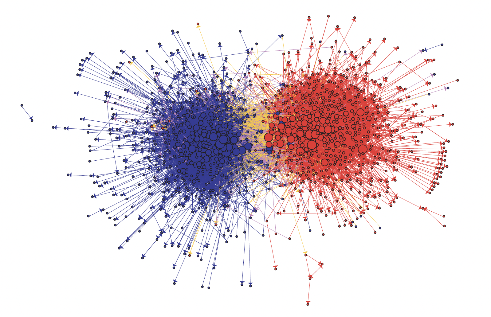
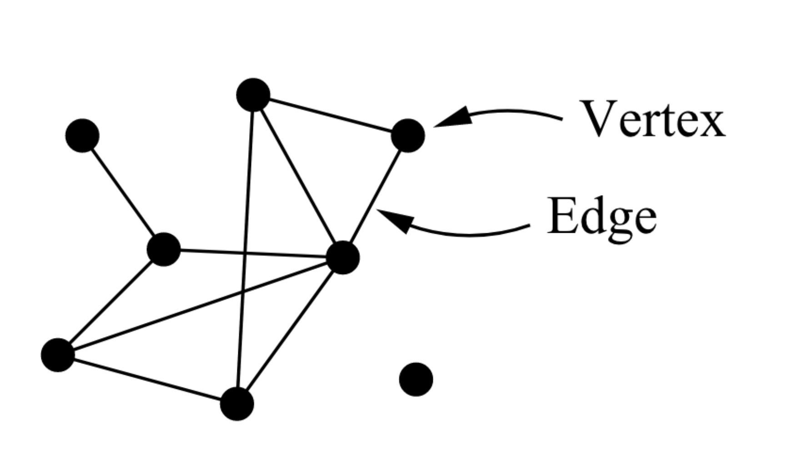
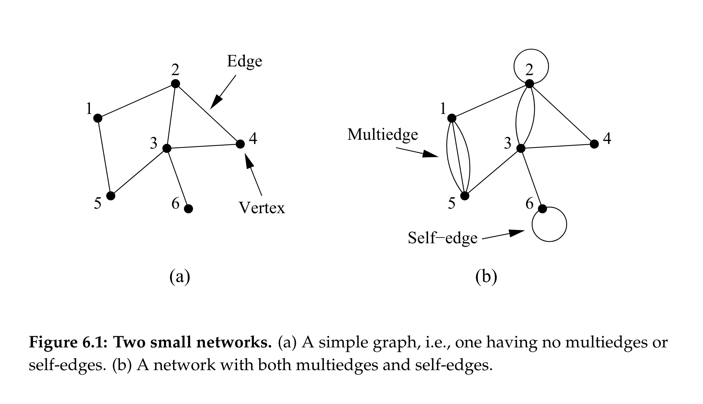
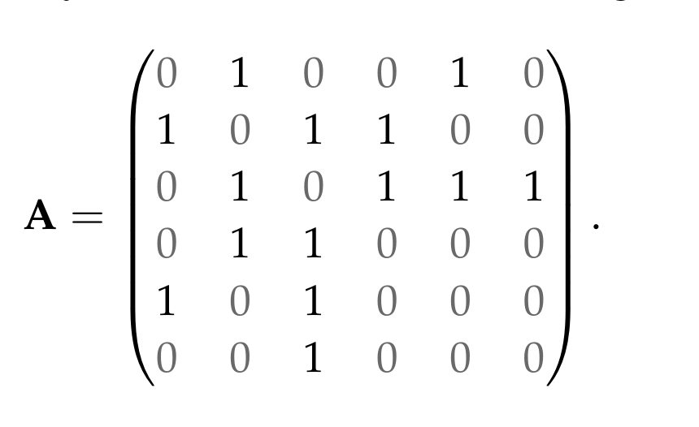
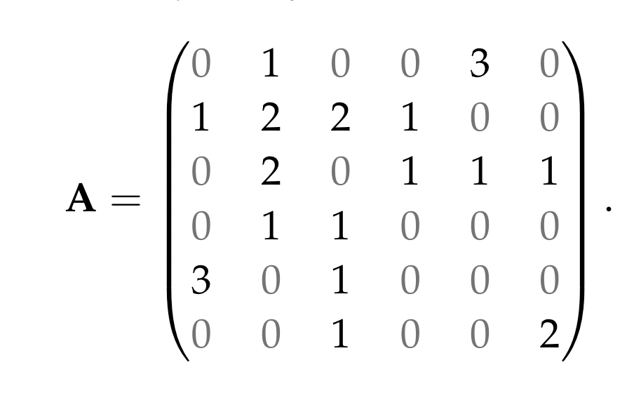

background-image: url('assets/USydLogo.svg')
background-size: 95%

<style>
pre {
  overflow-x: auto;
}
pre code {
  word-wrap: normal;
  white-space: pre;
}
</style>

```{r setup, include=FALSE}

options(htmltools.dir.version = FALSE)

knitr::opts_chunk$set(echo = TRUE, message = FALSE, warning = FALSE, cache = FALSE, 
                      dev = 'svg', 
                      fig.width = 4, 
                      fig.height = 4, out.width="30%",
                      fig.align="center")

library(knitr)
library(kableExtra)
library(tidyverse)
library(sf)
library(DiagrammeR)
library(cowplot)
library(gapminder)
library(ggrepel)

ggplot2::theme_set(theme_bw())

```

---
class: inverse, center, middle

# Network and Spatial Analysis

---

## Acknowledgement of Country

I would like to acknowledge the Traditional Owners of Australia and recognise their continuing connection to land, water and culture. The  University of Sydney is located on the land of the Gadigal people  of the Eora Nation. I pay my respects to their Elders, past and present.

---

## Recap from last week

- Language and Modelling
- Tokenization, Stop Words & Stemming
- Sentiment analysis
- Document-Frequency Matrix
- Word Embeddings

---

## Plan for today

### Back to the basics

1. Research question: How to write
2. Data analysis in R for A3
3. Network analysis
4. Spatial analysis

---
class: inverse, center, middle

# Research question: How to write it

---

## How to write a research question for a quantitative study

### 1. State variables in research questions

- The researcher may compare groups on an independent variable to see its impact on a dependent variable as in an experiment or group comparison. 

- The investigator may relate one or more predictor variables to an outcome variables (e.g., in a survey project).

.footnote[Adapted from Creswell, J. W., & Creswell, J. D. (2022). *Research design qualitative, quantitative, and mixed methods approaches* (Sixth edition). SAGE. ]

---

### 2. Link (implicitely or explicitely) your question to some theory: What is going on?

- The most rigorous form of quantitative research follows from a test of a theory and the specification of research questions or hypotheses that logically follow or challenge the theory. The researcher adapts a theory (often from the literature) to fit a specific study.

- In you A3, you don't need to detail a theory - but you should think about a theory that can justify your research question.

.footnote[Adapted from Creswell, J. W., & Creswell, J. D. (2022). *Research design qualitative, quantitative, and mixed methods approaches* (Sixth edition). SAGE. ]

---

### 3. The research questions should state a relationship among variables and imply an hypothesis.

- The hypothesis you want to test should be about the relationships among variables.

### 4. Think about directional words, such as affect, influence, predict, impact, determine, cause, and relate to help frame your question into a theory.

.footnote[Adapted from Creswell, J. W., & Creswell, J. D. (2022). *Research design qualitative, quantitative, and mixed methods approaches* (Sixth edition). SAGE. ]

---

## Research questions, exemples

.content-box-yellow[

We want to study the meaning of **gender identity** for religious and secular Jewish and Arab women in Israeli society. The theory is that gender identity is important (for some reason) in shaping political participation and social action.

We run a survey, then we ask/we test:

]

**RQ1**:  Are religious women with salient gender identity less socio-politically active than secular women with salient gender identities?

**RQ2**: Are the relationships among gender identity, religiosity, and social actions weaker among Arab women than among Jewish women?

--

- What are the variables mentioned in this questions?

--

- What is the model we can test test?

.footnote[Adapted from Creswell, J. W., & Creswell, J. D. (2022). *Research design qualitative, quantitative, and mixed methods approaches* (Sixth edition). SAGE. ]

---
class: inverse, center, middle

# A data analysis R pipeline: A review

---

## Key steps of a data analysis pipeline

1. Formulate a question and explain why is relevant
2. Get the data
3. Describe, Manipulate and Select the data (not necessarily in this order!)
4. Analyse the data
5. Present your conclusions!

---
class: center, middle

# What does determine student evaluation? (Padlet)

https://sydney.padlet.org/francescobailo/what-does-determine-student-evaluation-k1t4byeayqeht9an


---
class: inverse, center, middle

# Individual quiz/tutorial: Step-by-step

---

## 1. Import the data

### How do we import the data in R?

- Use a function such as read.csv()

- Use the RStudio import functionalities.

- Remember that special formats might require you to install a package.

- When you read your data in (usually from a table), you store it into some named object (e.g., a data frame) that you can see in your environment.

.center[.content-box-red[Complete **1. Import the data**]]

---

##  2. Data exploration

- It is always important to know your data!

In the exercise we use real data collected for this study if you want to read it: Hamermesh, D. S., & Parker, A. (2005). Beauty in the classroom: Instructors’ pulchritude and putative pedagogical productivity. *Economics of Education Review*, 24(4), 369–376. https://doi.org/10.1016/j.econedurev.2004.07.013

---

- `eval`: The student evaluation on a 1-5 Likert scale.
- `beauty`: The instructor beauty according to ratings from six undergraduate students (three women and three men) based on the instructor's picture. This variable was standardised. 
- `female`: Whether the instructor is a female.
- `age`: Age of instructor.
- `minority`: Whether the instructor is part of a minority.
- `nonenglish`: Whether the instructor is not a native English speaker.
- `lower`: Whether the course was offered in the first years of the program.
- `course_id` The ID identifying the course.

.center[.content-box-red[Complete **2. Data exploration**]]

---

## 3. Data description

- Data description is about providing 

  * Key descriptive statistics about the data (e.g., the mean of some variable for men and women) - Consider using tables!
  * Visualisation of the key variables.

```{r fig.width = 4, fig.height= 3, out.width = "25%"}
library(ggplot2)
ggplot(mpg, aes(displ, hwy, colour = class)) + 
  geom_point()
```

---

### Let's quickly review your options when it comes to visualisation

.center[[Slide from Week 03](https://fraba.github.io/SSPS4102-SSPS6006/slide/week-03.html#50)]

.center[.content-box-red[Complete **3. Data description**]]


---

## 4. Data Manipulation

### Let's quickly review how to manipulate your data with dplyr

.center[[Slides from Week 05](https://fraba.github.io/SSPS4102-SSPS6006/slide/week-05.html#28)]


.center[.content-box-red[Complete **4. Data Manipulation**]]

---

## 5. Data analysis

Once you have identified your variables of interest you can test their statistical association with a **linear regression**:

```{r eval = F}
lm(Y ~ X1 + X2, data = my_data)
```

... and if your Y is a binary variable, we use the **logistic regression** 

```{r eval = F}
glm(Y ~ X1 + X2, data = my_data, familly = "binomial")
```

---

### Correlation 

.center[[Stats slides from Week 06](https://canvas.sydney.edu.au/courses/59609/files/39052980?module_item_id=2474521)]


### Confounders

.center[[Stats slides from Week 08](https://fraba.github.io/SSPS4102-SSPS6006/slide/week-08.html#9)]


### Hypothesis testing (we will come back to this next week)

.center[[Stats slides from Week 08](https://canvas.sydney.edu.au/courses/59609/files/39344193?module_item_id=2488482)]

.center[.content-box-red[Complete **5. Data analysis**]]

---

class: inverse, center, middle

# Week 12 Individual Means Test (In-class) 

```{r echo = FALSE}
library(countdown)

countdown(minutes = 15, seconds = 00)
```

---

## How to make your USS feedback count

.small[

Your Unit of Study Survey (USS) feedback is **confidential**. It’s a way to share what you enjoyed and found most useful in your learning, and to provide constructive feedback. It’s also a way to ‘pay it forward’ for the students coming behind you, so that their **learning experience** in this class is as good, or even better, than your own. 

When you complete your USS survey (https://student-surveys.sydney.edu.au), please:

]

.pull-left[

.small[

**Be specific**. 
Which class tasks, assessments or other activities helped you to learn? Why were they helpful? Which one(s) didn’t help you to learn? Why didn’t they work for you? 

**Be constructive**. 
What practical changes can you suggest to class tasks, assessments or other activities, to help the next class learn better? 

**Be relevant**. 
Imagine you are the teacher. 

]

]


.pull-right[

 What sort of feedback would you find most useful to help make your teaching more effective?

.center[]

]
---

class: inverse, center, middle

# Network analysis

.center[</img>]

---

## Network analysis

#### Relations, not attributes. Networks, not groups.

> [S]ocial network analysts argue that causation is not located in the individual, but in the social structure. While people with similar attributes may behave similarly, explaining these similarities by pointing to common attributes misses the reality that individuals with common attributes often occupy similar positions in the social structure. 

> That is, people with similar attributes frequently have similar social network positions. Their similar outcomes are caused by the **constraints**, **opportunities** and **perceptions** created by these similar network positions. (Marin & Wellman, 2011, p. 13)


---

#### Network data: A few examples

Each member of the U.S. House of Representatives is a **node** - Rs are red and Ds are blue -  while **edges** are drawn between members who agree above the Congress’ threshold value of votes. (Andris et al., 2015) 

.center[</img>]

---

#### Network data: A few examples

Each **node** is a US political blog - right-wing are red and left-wing are **blue** - while each edge is a link from one blog to another (Adamic & Glance, 2005).

.center[</img>]

---

#### Network data: A few examples

Each **node** is a country while each **edge** represents the trade between the two countries. 

```{r echo = F, out.width='100%', fig.width=9, fig.height=5}
trade <- 
  read.csv(
    "https://raw.githubusercontent.com/kosukeimai/qss/master/DISCOVERY/trade.csv")

trade <- 
  trade %>%
  dplyr::filter(year == 2000 & 
                  exports > 50)

top_c <- 
  trade$country1[order(trade$exports, decreasing = T)][1:100]

trade.g <- 
  igraph::graph_from_data_frame(trade  %>%
                                  dplyr::select(country1, country2, exports))

require(ggnetwork)
require(ggrepel)


trade.lo <-
  ggnetwork(trade.g, layout = igraph::layout_with_fr(trade.g))

trade.lo$label <- trade.lo$name
trade.lo$label[!trade.lo$name %in% top_c] <- NA


ggplot(trade.lo, aes(x = x, y = y, xend = xend, yend = yend)) +
  geom_edges(color = "grey50", curvature = 0.1, alpha = .2) +
  geom_nodelabel_repel(aes(label = label),
                       fontface = "bold", box.padding = unit(1, "lines"),
                       max.overlaps = 200) +
  geom_nodes() +
  theme_blank()

```


---

## Network data

* Network data is data about relationships (**edges**) among **vertices** (also known as **nodes**). 

* Everything can be a node. And everything can be an edge. 

.center[</img>]

---

### Network data: The adjacency matrix

Let's assume I want to analyse this networks. How can I store the data? A common way to do it is with an adjacency matrix...

.center[</img>]

Source: Newman, 2010, p. 111.

---

### Network data: The adjacency matrix

This is how we define each entry in the matrix:

\begin{equation}
    A_{ij} =
    \begin{cases}
      1 & \text{if there is an edge between vertices}\ i\ \text{and}\ j \text{,} \\
      0 & \text{otherwise.}
    \end{cases}
\end{equation}

This is how the adjancency matrix for the simple network (a) we saw in the previous slide looks like


.center[</img>]

Source: Newman, 2010, p. 111.

---

### Network data: The adjacency matrix

And this is how the adjacency matrix looks like for the more complex network (b) we saw before with multiple edges and self-edges. 

.center[</img>]

Source: Newman, 2010, p. 112.

---

### Network data: The edge list

A second common way to represent and store network data is the edge list. In ad edge list, eacg row of a table is an **edge** between two end point **nodes**. 

```{r echo = F}

trade %>%
  select(country1:exports) %>%
  sample_n(6) %>%
  kable()
  
```

Addition columns in the edge list (here `year` and `exports`) represent attributes of the edges. 

Both edges and nodes can have attributes (e.g. name, gender, etc).

---

### Creating a network object with igraph

Let's get some network data (from Imai, 2017)

```{r}
florence <- read.csv("../data/florentine.csv", row.names = "FAMILY")
```

Here how the first five columns/rows of our adjacency matrix look like.

```{r echo = FALSE}
florence %>%
  select(1:5) %>%
  slice(1:5) %>%
  kable()
```

Values 1/0 in a cell of the matrix represents marriage/no marriage among the first five Florentine families.

---

In this case the network is **undirected** and the matrix is symmetric (across the diagonal running from the top-left corner to the bottom-right corner). Yet networks can be **directed** (e.g. Twitter followers).  

---

## Packages we are going to need

```{r eval = F}
install.packages("igraph") #<< core package for network analysis
install.packages("ggnetwork")  #<< net viz with ggplot
install.packages("intergraph") #<< support package to transform graph obj
```

---

### Networks in igraph

```{r}
library(igraph) # This is the library for network analysis #<<

florence <- 
  as.matrix(florence)
```

```{r}

florence.g <- 
  igraph::graph.adjacency(florence, #<< 
                          mode = "undirected", #<<
                          diag = FALSE) #<<

```

`igraph::graph.adjacency()` will create a an igraph *graph* (network) object from an edgelist (igraph has many other functions to create a network, for example `igraph::graph.edgelist`).

Note that if your data comes in an edge list, you can similarly use `igraph::graph.edgelist()`.

---

```{r}
florence.g
```

By typing the name of the network in console I get its details. Here I learn that that my network is **undirected** (`U`), named (`N`), has 16 **nodes** and 20 **edges**.

And then we can plot our network with our good ol' friend, `ggplot()`

---

```{r out.width = "80%", fig.width = 7, fig.height = 5}

ggplot(florence.g, aes(x = x, y = y, xend = xend, yend = yend)) + #<<
  geom_edges() +
  geom_nodes() +
  geom_text(aes(label = name))
```

---

### Network statistics about centrality

A common question about networks is, which nodes are more structurally important? Indeed, a highly connected node is structurally more important than a peripheral, weakly connected node. 

If we are interested in **power** in Renaissance's Florence, then network centrality in the intermarriage network can be an effective measure of power. 
 
How do we measure it? (Un)fortunately, there are more ways to measure node's centrality. 

* **Degree** is the number of connections of a node. But it only measures the immediate neighborhood of a node. So ...

* **Closeness** measures the average *distance* between one node and every other node, so the number of hops if you jump from node to node following the connections. 

* **Betweenness** is the instead a measure for the number of *paths* that traverse a node as you move between any other pair of nodes. 

---

### Difference between degree, closeness and betweenness as centrality measure

<iframe width="800" height="500" src="https://www.youtube.com/embed/0aqvVbTyEmc" title="YouTube video player" frameborder="0" allow="accelerometer; autoplay; clipboard-write; encrypted-media; gyroscope; picture-in-picture; web-share" allowfullscreen></iframe>


---

### Network centrality with igraph

```{r}
igraph::degree(florence.g)

igraph::closeness(florence.g)
```

---

```{r}
igraph::betweenness(florence.g)
```

---

## What's next with R and network analysis?

Are you interested in using R for network analysis?

This vignette gives you a good intro into igraph, which is especially effective for network manipulation (not great network visualisations, though):

* https://cran.r-project.org/web/packages/igraph/vignettes/igraph.html

Also, for a very useful tutorial on R and igraph have a look here:

* https://kateto.net/netscix2016.html

After that of course sky is the limit!

---

class: inverse, center, middle

# Spatial analysis


---

# What is GIS

.small[

.pull-left[
> A geographic information system (GIS) is a **computer system** for **capturing**, **storing**, **checking**, and **displaying** data related to positions on Earth’s surface. GIS can show many different kinds of data on one map, such as streets, buildings, and vegetation. This enables people to more easily see, analyze, and understand patterns and relationships. (Source: [National Geographic](https://education.nationalgeographic.org/resource/geographic-information-system-gis))
]

.pull-right[ 
*Source: U.S. Government Accountability Office*]

]

---

<video controls autoplay>
  <source src="https://www.tylermw.com/wp-content/uploads/2021/01/featureosm.mp4" type="video/mp4">
 </video>

*Source: [Tyler Morgan-Wall](https://www.tylermw.com/adding-open-street-map-data-to-rayshader-maps-in-r/)*

---
class: inverse, center, middle

# Spatial data 

---

## Vector and raster data

 
*Source: Marijan Grgic, University of Zagreb, Faculty of Geodesy.*

---

## Vector data vs raster data

* **Vector data** represent geographic information through vertices and paths between these vertices.

```{r echo = F, cache = T, fig.width = 12, out.width='100%'}

require(tidyverse)

require(sf)

require(osmdata)

building <- opq(bbox = c(151.186598,-33.886771,151.189758,-33.884753)) %>%
  add_osm_feature(key = 'building') %>%
  osmdata_sf()

leisure <- opq(bbox = c(151.186598,-33.886771,151.189758,-33.884753)) %>%
  add_osm_feature(key = 'leisure') %>%
  osmdata_sf()

highway <- opq(bbox = c(151.186598,-33.886771,151.189758,-33.884753)) %>%
  add_osm_feature(key = 'highway') %>%
  osmdata_sf()

grid.sf <- 
  st_make_grid(rbind(building$osm_polygons %>%
                       dplyr::select(osm_id),
                     leisure$osm_polygons %>%
                       dplyr::select(osm_id)), cellsize = .0001)

grid.sf <- 
  st_sf(id = 1, geometry = grid.sf)

res <- 
  st_intersects(grid.sf,
                     building$osm_polygons %>%
                       dplyr::select(osm_id))

grid.sf$intersect <- 
  lengths(res) > 0

  ggplot() +
    geom_sf(data = building$osm_polygons, fill = "orange", alpha = .4) +
    geom_sf(data = leisure$osm_polygons, fill = "green", alpha = .4) +
    geom_sf(data = highway$osm_lines, colour = "white", alpha = .4, linewidth = 2) +
    geom_sf(data = building$osm_points, colour = "orange") +
    geom_sf(data = leisure$osm_points, colour = "green") +
    geom_sf(data = highway$osm_points, colour = "white") +
    coord_sf(xlim = c(151.186598, 151.189758),
             ylim = c(-33.886771, -33.884753))

```

---

## Vector data vs raster data

* **Raster data** instead represent geographic information through a uniform grid (or a matrix). 

```{r, echo = F, fig.width = 12, out.width='100%'}
  ggplot() +
    geom_sf(data = grid.sf, aes(fill = intersect), alpha = .5) +
      geom_sf(data = leisure$osm_polygons, fill = NA) +
    coord_sf(xlim = c(151.186598, 151.189758),
             ylim = c(-33.886771, -33.884753)) +
  guides(fill = "none")
```

---

## Vector data vs raster data

```{r echo = F, out.width = "100%"}

require(leaflet)

leaflet::leaflet() %>% 
  leaflet::addPolygons(data = building$osm_polygons, group = "Buildings (vector polygons)", color = 'blue',) %>%
  leaflet::addCircleMarkers(data = building$osm_points, group = "Buildings (vector points)", color = 'orange', 
                   radius = 1, fillOpacity = 1, opacity = 1) %>%
  leaflet::addPolygons(data = grid.sf, group = "Buildings (raster)",
              opacity = 1, fillOpacity = 1, color = "black", fill = ~intersect, weight = 1) %>%
  leaflet::addProviderTiles(providers$Esri.WorldImagery) %>%
  leaflet::addLayersControl(
    overlayGroups = c("Buildings (vector points)", "Buildings (vector polygons)", "Buildings (raster)"),
    options = layersControlOptions(collapsed = FALSE)
  )

```

---

## GIS software

Among the most popular desktop GIS applications are

* **ArcGIS** (from ESRI): This is likely the most commonly used GIS by professionals. It is proprietary and not cheap.

* **QGIS**: This is the most popular open source desktop GIS. It has a large community of developers and users.

Among the most popular spatial database management systems is

* **PostGIS** (An open source extensions for the also open source PostgreSQL). You need it if you are planning computationally intensive geographic analysis.

Although you can do all your geographic analysis and mapping in R, it is sometimes handy to open your data in a desktop app such as QGIS. 

A GIS desktop application is essential if you plan to create or edit geographic data. 


---
class: inverse, center, middle

# Lab

## Spatial data and analysis in R

---

## Simple Features

> **Simple Features** ... is a set of standards that specify a common storage and access model of geographic feature. (Source: [Wikipedia](https://en.wikipedia.org/wiki/Simple_Features)).

### The sf package for R

.small[

.pull-left[

.center[]

.center[https://r-spatial.github.io/sf/]

]

.pull-right[

* Represents simple features as records in a `data.frame` with a geometry list-column.
* Extensive access to functions for *confirmation* (e.g. `st_contains`), *operations* (e.g. `st_buffer`) and creation (e.g. `st_point`).
* Excellent integration with **ggplot2** using `geom_sf()`...
* Excellent integration with **Leaflet** to produce online interactive maps...

]
]

---

## The sf integration with ggplot: geom_sf()

Once you have the data in the right sf format (e.g. `nc` below), producing some visualisation is as easy as ...

```{r echo = F}
require(ggplot2)

require(sf)

nc <- sf::st_read(system.file("shape/nc.shp", package = "sf"))
class(nc)
```

Note that `nc` is a special type of data frame with regular as well as spatial information.

---

## Plotting Spatial Data


```{r, echo=TRUE, out.width='70%'}
library(ggplot2)
library(sf)
ggplot(nc) + 
  geom_sf()
```

---

## Let's load some data for a map of countries of the entire world.

```{r}
library(rnaturalearth)
library(rnaturalearthdata)


world <- 
  rnaturalearth::ne_countries(scale = "medium", returnclass = "sf")
world
```

- `ne_countries()` returns world country *polygons* at a specified scale (scale determine size of map!) 

.footnote[Adapted from https://r-spatial.org/r/2018/10/25/ggplot2-sf.html]

---

## Basic plot

This is a ggplot, so you can customise it exactly as you would with ggplot.

```{r out.width = "70%"}
ggplot(data = world) +
    geom_sf()
```


---

## Change colors

Note that we set `color` and `fill` outside of `aes()` so they are the same for all countries.

```{r out.width = "65%"}
ggplot(data = world) + 
    geom_sf(color = "black", fill = "lightgreen")
```

---

## Let's download some interesting data from the World Bank database using

```{r eval = F}
install.packages("wbstats")
```

### Child mortality data

See https://data.worldbank.org/indicator/SH.DYN.MORT

```{r}
library(wbstats)
child_data <- 
  wbstats::wb_data("SH.DYN.MORT", 
                   mrv = 1) #<<
```

You have many option (`?wb_data`).
- `mrv = 1` will return the most recent value for each country.

---

## Let's join the two data frames: the world map and the World Bank data.

```{r}
library(dplyr)
world <- 
  world |> 
  dplyr::left_join(child_data, 
                   by = c(adm0_a3 = "iso3c")) #<<
```

- Note the `by` argument. You must have a column with some code or name to join the two tables.

- Let's check the result from join (we often have un-matched records).

```{r}
summary(world$SH.DYN.MORT)
```

---

## And final we plot...

- Note that now `fill` is set within `aes()`.

```{r fig.width = 10, fig.height = 3, out.width = "100%"}
ggplot(data = world) + 
    geom_sf(aes(fill = SH.DYN.MORT))  #<<
```

---

## And final we plot... with a different palette

```{r fig.width = 10, fig.height = 3, out.width = "150%"}
ggplot(data = world) + 
  geom_sf(aes(fill = SH.DYN.MORT)) +
  scale_fill_viridis_c(option = "plasma", trans = "sqrt")  #<<
```


---
class: inverse, center, middle

# Attendance

---
class: inverse, center, middle

# See you next week!


